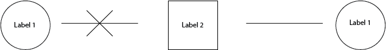
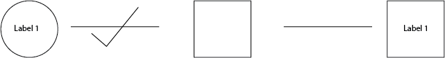
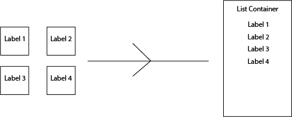
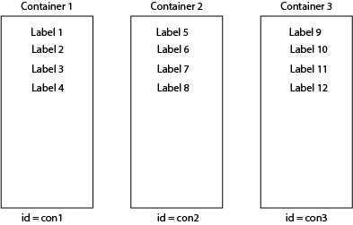

# Crushing Bugs Assignment
This repository is for the crushing bugs assignment in the Multimedia Authoring 2 Course in IDP3 @ Fanshawe in which we had fix two bugs within the drag and drop anatomy game completed during class. The original scope of the game allowed individuals to drag and drop labels into zones located over different anatomy sections of the given image. 

- The first bug involved being able to drop multiple labels into the same dropzones
- The second bug was the reset button not working to reset the locations of the labels after they were dragged and dropped in the drop zones

## Planning and Research

**Thought Process: Problem One**

1. The first problem was to ensure only one label could exist inside each drop zone 
2. In other words, when you drag a label over the drop zone to drop it inside, the program first has to check if there is already a label inside the drop zone. 

If there’s a label already inside the drop zone, you exit the ‘dropped’ function before it can append the new label and the currently dragged label returns to its original container 

If there isn’t a label inside the drop zone, then you continue the function, eventually appending the new label 

How to check if there’s a label? 
- Checking for a label, in other words, means checking if there’s a child element (label) inside of the parent element (in this case, the drop zone) 
- One way you can do this, is to use the `firstChildElement` with an `if` statement, checking if the condition of having a child element is true or not. 
- However, the way I went about it was to use `querySelector` to see if the target zone contained an element with the class ‘label’. If it did, I used `return` in order to exit the function 

**Thought Process: Problem Two** 

1. The second problem to solve was resetting the labels using the reset button 
2. In other words,when the player `clicks` the reset button, gather all the labels and return them to their original container. 

### Step One: Handling the Button 

Since this required user interaction, I first:
- Selected the reset button
- Attached a click `event listener`
- Triggered a reset function when clicked

### Step Two: Gathering the Labels

Then since the labels had already been collected into a NodeList (array-like structure), inside the reset function, I:
- Looped through each label using `forEach()`
- `Appended` each label back to its original container

### The Challenge: Identifying the correct parent container
- The quick solution would be to use querySelector to select the parent container through `id` or `class` and then append each label to that element 

However, this approach would not scale well if:
- The game expanded
- Multiple containers existed
- Different labels belonged to different containers
- There would be no reliable way to know which label belonged to which container inside the loop.

During research for a previous (ongoing) project, I came across `datasets` and how you could assign different values to elements and then use dot notation to access those values at a later time. 

With each container having a unique id, you could assign that id to the dataset of the label as parentId so that later when your using `querySelector` to access the parent element, you can reference the specific id of each label in a more dynamic way that changes with each label in the loop.

**When to Assign the Parent ID**
- Initially, I considered assigning the parent ID during the drag event.
- However, I realized that if a label were dragged to multiple drop zones, its stored parent ID would be overwritten.

**To prevent this:**
- I created a separate function to assign the original parent ID.
- This function ran once before any game logic executed.
- The stored parent ID remained constant throughout gameplay.

**Final Process Summary**
- Assign each label a data-parent-id (once at initialization).
- When a label is dragged to a drop zone:
    - Check if the drop zone already contains a label.
    - If it does, exit the function.
    - If not, append the label.
- When the reset button is clicked:
    - Loop through all labels.
    - Retrieve parentId from each label’s dataset.
    - Select the corresponding parent element.
    - Append the label back to its original container.

## Installation
No installation required. Simply download the zip file and extract.

## Usage
Open the `index.html` file in the browser of your choice.

## Contributing 
- Fork it! 
- Create your feature branch:`git checkout - b my-new-feature`
- Commit your changes: `git commit -am ‘Add some feature’` 
- Push to the branch: `git push origin my-new-feature`
- Submit a pull request 

## Credits
- Crystal Underhill 

## Licence 
See MIT Licence file